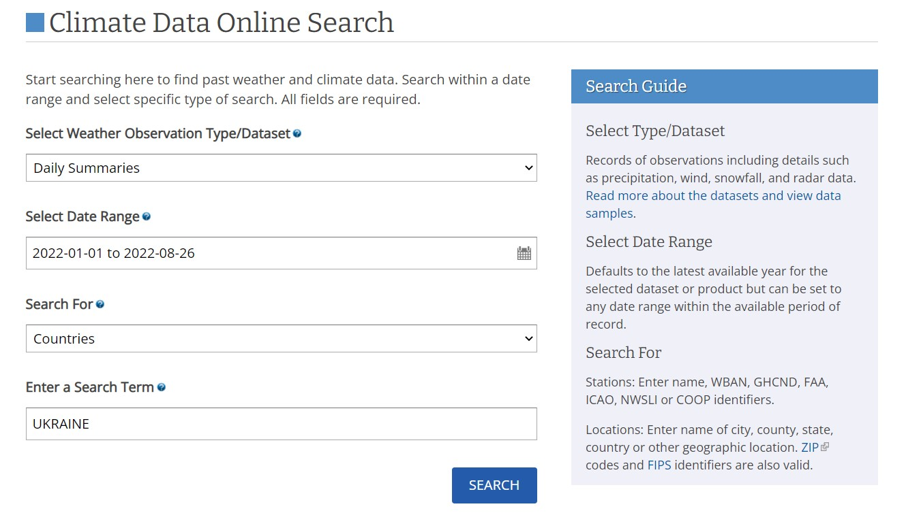
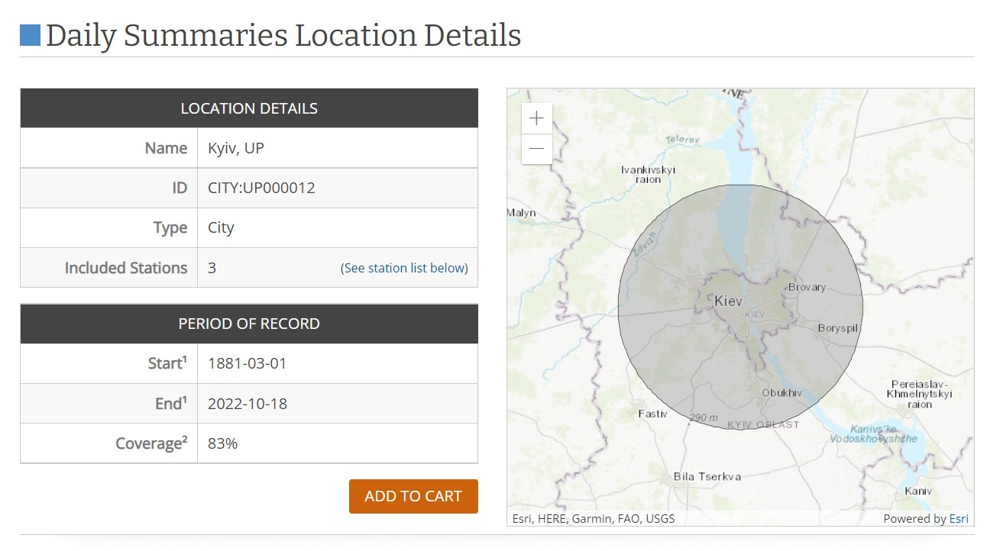
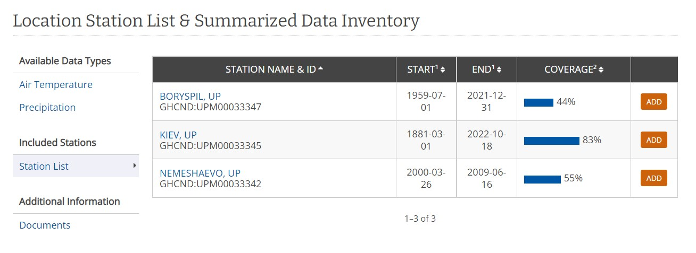
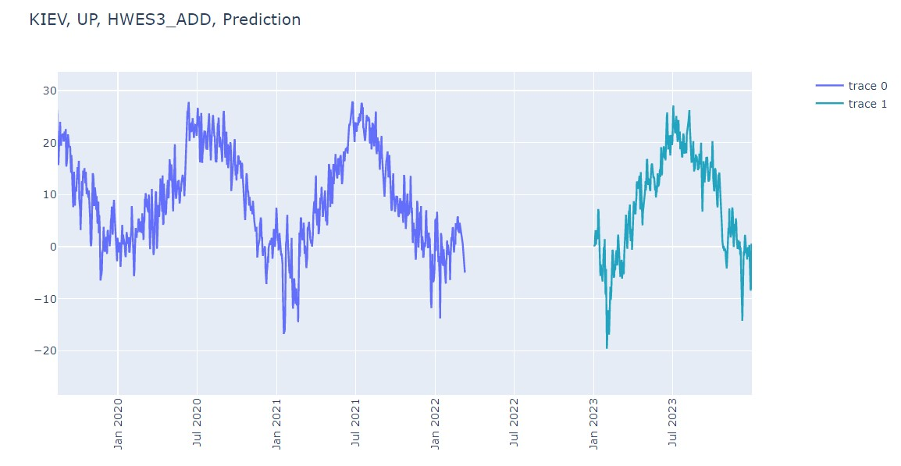
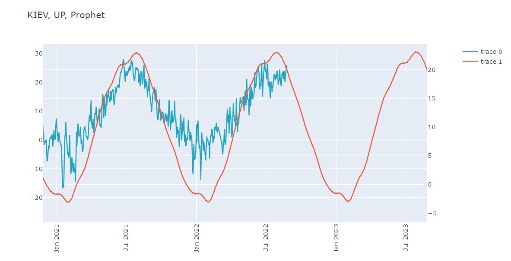

# Random-Processes-in-Meteorology
Climate change is the observed and projected long-term changes in average climate, as well as climate variability, caused by human activity, including such anomalies as droughts, severe storms and floods.

The climate of our planet has been constantly changing throughout the entire geological history of the Earth, and these changes were accompanied by significant fluctuations in average global temperatures. One of the main drivers of global average temperature change is the burning of fossil fuels, coal, gas and oil, which has increased the concentration of greenhouse gases such as carbon dioxide in our atmosphere.

The use of temperature prediction models is of great practical importance, starting from predicting the temperature for the next year for sowing, crop yields, etc. Everything directly helps to solve the problem of hunger on a global scale.

The National Oceanic and Atmospheric Administration (NOAA) is a federal agency within the Department of Commerce that conducts various types of meteorological and geodetic research and forecasts for the United States, its territories and worldwide, as well as the study of the world's oceans and atmosphere.

The NOAA website contains open data, where it is possible to find local climatological data, marine data, annual and seasonal norms, etc. for a certain period of time. For the practical part, we will use open data from measurements of stations in the Kyiv region.

- Done by Dmytro Zhuk for "MODERN RESEARCH IN WORLD SCIENCE" scientific conference in Lviv, Ukraine.
- Conference source: https://sci-conf.com.ua/ix-mizhnarodna-naukovo-praktichna-konferentsiya-modern-research-in-world-science-28-30-11-2022-lviv-ukrayina/

To see the full project click on the <a href = "test1DmytoZhuk.ipynb">test1DmytoZhuk.ipynb </a>file.

---

## The data:

https://www.ncdc.noaa.gov/cdo-web/

1. STATION - Number of the certain station
2. NAME - Name of the certain station
3. LATITUDE, LONGITUDE - Latitude, Longitude
4. DATE - Date
5. TAVG - Average Temperature
6. TMAX - Maximum temperature
7. TMIN - Minimum temperature
8. PRCP - Precipitation
9. SNWD - Snow depth

---

## Holt-Winter's model: 

mean_squared_error(temp1.values[365:730], data) # MSE
26.316476334574727

mean_absolute_error(temp1.values[365:730], data) # MAE
4.036518487071952

r2_score(temp1.values[365:730], data) # R^2
0.7024258165900131

## Prophet model: 

mean_squared_error(temp1.values, forecast.iloc[0:11316]["yhat"].values) # MSE
17.296278436536348

mean_absolute_error(temp1.values, forecast.iloc[0:11316]["yhat"].values) # MAE
3.296445347214469

r2_score(temp1.values, forecast.iloc[0:11316]["yhat"].values) # R^2
0.8233631153055813

---

## Summary:
As a result of the work done, several conclusions can be drawn:

- Prophet library has higher R^2 score and lower MSE, MAE respectively. Despite Prophet being half-black box model, it predicts pretty well using Supervised methods - the model captures generalization of the data as well as seasonality and stationarity.
- Using models of classical time series prediction (for example, Exponential smoothing, Holt-Whinter's method), supervised machine learning (Prophet), it becomes possible to scale them, forecast for long periods of time.
- With the help of these models, it is possible to process and predict different types of data, such as: temperature, precipitation level, snow depth. Also, forecasts can be used for versatile purposes of human activities.
